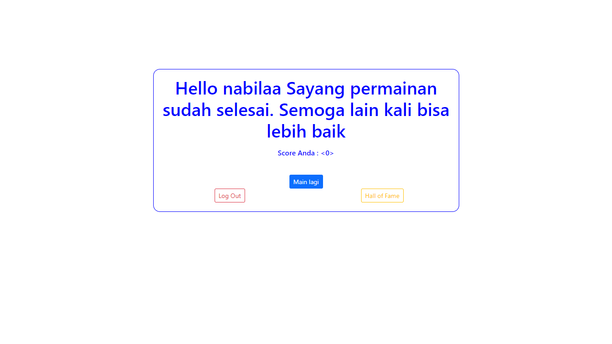

# UTS PEMROGRAMAN WEB
## Nabila N A K3519061

Pada project kali ini, dibuat sebuah game matematika berbasis web menggunakan php. untuk desainnya menggunakan framework bootstrap.
Pada game ini, diberikan form login (gambar1) untuk dapat menyimpan data dari user. setelah login (gambar2), maka akan muncul tampilan awal untuk memulai game. Saat game dimulai (gambar3) akan diacak dua bilangan, lives diatur menjadi 5, score diatur menjadi 0. Ketika berhasil menjawab benar (gambar4) maka score akan bertambah 10. jika menjawab salah (gambar5) maka score akan berkurang 2, dan lives berkurang 1. Lives akan terus berkurang ketika jawaban salah, dan ketika lives sudah mencapai 0 (gambar6) maka akan muncul tampilan game over dan tombol untuk mereset game.
Untuk melihat top 10 leaderboard, dapat menggunakan tombol hall of fame (gambar7).

 

# **Tampilan Awal Website**

# **Tampilan Website Setelah Login**

# **Tampilan Awal Game

# **Tampilan Ketika Menjawab Dengan Benar**

# **Tampilan Ketika Menjawab Dengan Salah**

# **Tampilan Ketika Nyawa Sudah Tersisa 0**

# **Tampilan Hall of Fame**

 

## Link Website : http://www.nabilaana.epizy.com/
